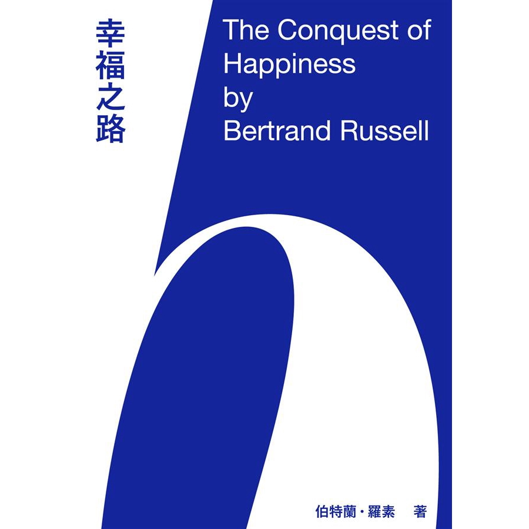

「你過得幸福嗎？」

你說，你也不知道。

你有一份朝九晚五的工作，在辦公室裡盯著螢幕敲敲鍵盤。偶爾需要加班，但不是那種每天朝九晚九假日還要趕進度的工作。

下了班、放了假，捷運通道上人來人往，卻不知道該往哪裡去、有什麼事好做。回到家，躺在床上，滑滑臉書看看廢片，過兩天又是新的工作天。想到再一個禮拜生日又到了，上個生日彷彿才剛過沒多久，而時間又悄悄走過一個年頭。

整體來說，你的日子還算過得去。身體還算健康，下背部因為久坐而不時酸痛，頭痛大約一個月會有一次，但沒有什麼大病；薪水一個月就是五萬塊，自己省吃儉用也能存點小錢；比起連下一餐都沒著落的難民，你知道自己算好的，但你就是覺得不滿足。那是一種重複再重複的空虛，工作、假日、工作、假日，而生活卻沒有進展。你覺得比起同年紀的人，自己好像該成就更多。以前的高中同學們有的出國深造去了，有的在 IG 上秀寶寶的照片，而自己卻還在這。

還可能幸福嗎？你問。

---

數學家與哲學家伯特蘭．羅素在<a href="https://www.taaze.tw/apredir.html?150626301/https://www.taaze.tw/products/11100905830.html?" target="_blank">《幸福之路》</a>這本小書向我們說，幸福是可能的，只要我們停止過分關注自身，並試著關注外界的事物。

什麼是過分關注自身？羅素提出三種過度關注自身的形式：罪人、自戀者、自大狂。

罪人好比小時候被父母嚴厲管教而過分乖巧的孩子。父母說罵髒話是罪惡的，孩子為了得到父母的愛，也只好認為罵髒話是罪惡的。因此，頂撞父母是罪惡的、有自己的想法是罪惡的、女人是罪惡的、自慰是罪惡的。為了不要犯罪，他為自己設下戒律，當自己觸犯戒律的時候，他便感到十分自責，成天想著如何避免自己再犯，他的心神全耗在戒律之上，沒有餘裕感受其它的事物。

自戀者則希望獲得他人的讚賞。為了被他人誇獎，他會去做一些自己實際上並不感興趣的事，例如為了得到師長的誇獎而努力用功的學生，當他不再獲得讚賞的時候，讀書就一點意思也沒有了；或者像社群媒體上發文炫耀出國度假的人們，暗自希望(儘管可能沒意識到)自己在他人眼裡過得很好，但當沒有人來按讚的時候，出國度假似乎就少了一半的魅力。自戀者過分關注自己在他人眼裡是否足夠好，而無法全心投入他所從事的興趣或工作中。

自大狂希望自己擁有權力控制他人，他們權力慾過剩，只關心眼下是否還有未臣服的他人，因此變得暴虐殘酷。終究遇到無法克服的阻礙時，便會鬱鬱不歡。

無論是哪一種形式，關注自我，就像伺侯一個永遠都不滿意的老闆一樣：不管你報告做得多詳細、工作有多準時，他總能挑出不滿的地方痛罵你一頓。在現實中遇到這樣的老闆，正常人都會果斷辭職；面對自我我們卻經常像個抖M，一邊挨罵一邊緊抓著不肯放手。因此，我們應該停止過度關注自我，該下班的時候，就下班吧。

停止過度關注自身之後，羅素說，我們可以透過對外界事物抱持友善的興趣，在活動中得到滿足感，無論是工作、與家人朋友相聚、興趣等等。羅素舉他家的園丁為例，儘管他目不識丁，收入也不多，但在園子裡抓捕野兔時，卻是十分快活。每天，他一心一意計畫如何逮到這些狡猾的現行犯，在園子裡和牠們鬥智鬥勇。他的注意力並不朝向自己，而是專注在如何打野兔上面。當我們專注在外在事物上，不受自身所困擾，自然就能過得滿足。以上當然，只是書的一小片段，他也談如何經營家庭、工作，如何培養次要的興趣、如何避免嫉妒與疲憊感，而這些都是在談，人可以如何過得幸福。

最後忘了說，這本書寫於 1930 年，是的，是近百年前的著作，可羅素所描述的這些人生哲理，在現代依然值得一讀。
