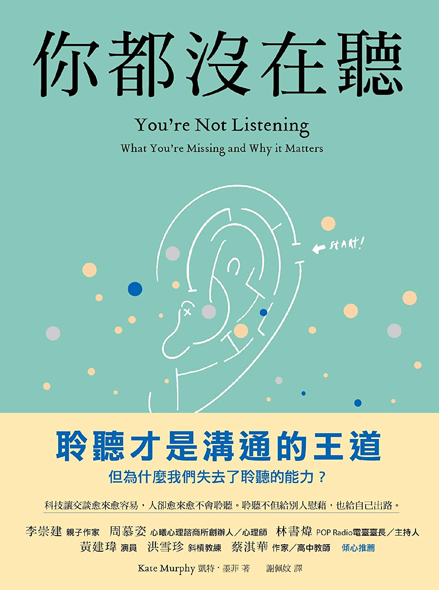

初次看到<a href="https://www.taaze.tw/apredir.html?150626301/https://www.taaze.tw/products/11100918546.html?" target="_blank">《你都沒在聽︰科技讓交談愈來愈容易，人卻愈來愈不會聆聽。聆聽不但給別人慰藉，也給自己出路》</a>，以為書名是出版社加油添醋過的(例如這幾年流行的「深度...力」，原名可能和深度一點關係都沒有唷，或許出版社發現台灣人就愛深度吧XD)，結果真的不是，原名就叫《You're Not Listening》。

這本書由十幾篇的小短文組成，從各種面向談傾聽是什麼、而我們為何難以傾聽。每個章節的份量不多，可以分開來讀，很適合一點一點慢慢讀完。

讓我試著用幾個片段來聊聊這本書在說什麼。

## 傾聽不是只有點頭。

不知道你有沒有遇過這種狀況：對方看起來很有禮貌，你說話時他會仔細看著你的眼睛，適度的點頭回應，但他接下來說的話卻讓你覺得他根本沒聽你說話，彷彿不管你前面說了什麼，他早就已經打定主意要說什麼了。

許多談及傾聽的書籍都在談這些技巧 –– 傾聽時應該不要打斷對方，重述對方的話語，並看著對方的眼睛，等等。這些實際上談的都是傾聽者外在的行為和表現，而非內在的態度。許多人學了這些技巧，便以為自己是善於傾聽的人了，但他們未必真的有在聽，只是看起來有在聽而已。

心理學家卡爾．羅傑斯提出了「主動傾聽」的概念，這本書這麼說：

> 羅傑斯這麼形容主動傾聽時的自己：「我聽見字句、想法、語調、個人想傳達的意涵，甚至說者意識表層底下的意義。」對他來說，主動傾聽的重點在於接納的心態，而不是外在的姿態。重要的是超越「請說事實就好，夫人」的心態，因為事實通常只占所傳遞訊息的一小部分。對話時，對方說的多半是對他們有意義的話。這些話會浮上腦海或從嘴巴講出來，是因為帶有期望值，希望得到他人的回應。能夠理解話語底下的意圖和意義，你就能跟對方產生連結。

換句話說，真正重要的應該是和對方的想法、意圖、情感產生連結，試著接納，即使他的想法和自己不同；而不是聽完然後用自己的想法一股腦兒倒給對方。我們都能很容易看出來看似專注卻只是在宣傳自己的想法的人。

這並不容易，除了心態上的調整之外，人還容易分神去想事情，忽略了聽到的東西。這是因為說想落差(The speech-thought differential) –– 大腦思考遠快於人說話的速度，人一分鐘可以說一百二十到一百五十個字，我們上億的腦細胞運作的可快得多。因此人很容易在傾聽時恍神，想早上出門前被老婆嫌棄的話，想對方的頭怎麼長得那麼像蘿蔔，想自己的薪水怎麼不漲......最多的，想接下來要說什麼，才能給對方一個完美的回應。這是為什麼神經質或內向的人可能難以傾聽他人，因為在別人說話的時候，他都在擔心自己表現得不好，或是回想過去失敗的經歷，或是對刺激太過敏感而無法專心聽話。

如果我們的腦子一直這樣分神，我們又要怎麼專注？作者訪問到其中一位編舞家這麼說：

>「我想重點在於，接受自己在對話中並非十全十美。」她說：「傾聽就是決定不再擔心接下來要說什麼。」這麼一來，才能讓「別人的想法和意見通過你的邊防」

## 傾聽不是質問。

質問是：
「功課寫了嗎？」
「案子的進度怎麼樣？」
「你怎麼能夠放棄？」

當我們用這類實際而封閉的問題與人對話時，看似我們是在關心他人，但，「實際上，你在逐一核對清單，確定事情是否完成，接下來又該做什麼。這不是真正的對話，也不是傾聽。」

傾聽當中的問題，更多是開放、誠實而探索式的問題：
「告訴我今天在學校發生了什麼事，好嗎？」
「可以和我分享在這個案子遇到了什麼困難嗎？」
「什麼讓你想要放棄？」
邀請對方向自己分享想法、感受和故事，對方會更願意說出更多事件背後的原因，甚至找出問題的解決方法。

這不只適用於日常生活或工作，在使用者研究的現場亦然。使用者研究專家娜歐蜜．韓德森(Naomi Handerson)曾經幫某間連鎖店研究顧客在深夜購物的動機。該怎麼問呢？「是因為有打折嗎？」「這和你的工作性質有關係嗎？」「為什麼你喜歡半夜來買東西？」我們很容易就能想出這樣的問題，但娜歐蜜不這麼問，而是邀請對方回顧以往的購物經驗：「告訴我你上一次十一點過後去購物的情景」。

Why? 你應該可以看得出來，前者的問題過於封閉，因此受訪者很容易順著給予正面的回應，我們便難以得知真正的原因；問「為什麼？」則容易讓人感到需要給自己的行為找個理由 –– 偏偏人們往往最不知道自己行為的背後原因，所以你得到的答案很有可能是受訪者當下「掰」出來的答案，卻不是他們真正的動機。後者則不然，它讓受訪者可以自然、不受拘束的回想上次深夜購物的狀況，研究者便可從使用者述說的故事中，找出大家來深夜購物的共通原因。

這正是開放、誠實而探索式的問題重要之處。

## 傾聽是好奇

作者訪問前 CIA 的探員貝瑞．麥馬努(Barry McManus)，想知道他為什麼總能得到別人得不到的情報。不如一般人對 CIA 探圓聰明巧詐的印象，他說，他只是喜歡聽跟他不一樣的人說話。

> 「就算沒有實質的收穫，我也瞭解了他們的心態、立場和想法。對方的外表如何？心裡在想什麼？對西方的看法？對我這種人的看法？那種經驗讓我血液沸騰，永生難忘，也讓我成為更好的人。」麥馬努說：「生命中的各種經驗造就了現在的你。就算你不能觸及自殺炸彈客的內心，說不定能觸及日後某個思想偏激或想不開的人的內心。跟誤入歧途的人交談過後，你才能更理解他們的想法。」

麥馬努喜歡了解他人，每進酒吧都會注意周遭環境，人們穿什麼衣服，在說什麼。他總能在別人身上發現未曾得知的事情。

> 「到了這個歲數，我總覺得很少有我沒聽過的事。但走出房間，我還是很驚訝：真不敢相信那傢伙剛剛告訴我的事。」比方他幫一個有錢的顧客篩選某位醫生，對方自動坦承她用藥成癮；還有一名遊艇船長坦承他會習慣性地割傷自己。

我們以為和陌生人說話不會有新鮮事，然而這種態度扼殺了好奇心，也讓他人不願意開口；傾聽源自於對他人坦誠的好奇，讓彼此有更深的連結。

## 傾聽是等待

一個即興喜劇工作坊的教練說，「如果某人告訴你的故事從肩膀開始，在指尖結束，那麼我們應該從哪裡開始停止傾聽？」大部分人會回答手肘，不會等到結束。但這對即興喜劇而言不夠，因此教練在帶新手工作坊時，會帶大家玩團體說故事的遊戲：出一個主題，教練指向某一個人時那個人就要說故事，換下一個人時就要接著上一個人的故事往下編。這並不容易，一大原因是因為新手常沒有聽完正在講話的對手說了什麼，或是想著要出風頭，因此要接話的時候漏掉了對方給的提示、細節不足，導致情節變得鬆散或不合理。在即興時，你必須等待伙伴說完話，注意聽他說了什麼，而不是急著想要說下一句話主導故事的走向。

甚至話說完的時候也未必是回應的時候。適度的沉默 -- 人們都害怕沉默，但沉默有用。作者訪問了一個業績頂尖的家具銷售員格雷，訪問的時候，格雷正在帶一位老夫妻看早餐桌和五斗櫃。介紹之後，那對夫婦猶豫了一段時間，甚至有數分鐘一句話也沒說。

此時，一般的銷售員為了能儘快成交接下一組客人，通常會忍不住向夫婦推銷更多，或力勸他們買下商品。但格雷沒有這樣做，他保持平靜，一邊觀察，一邊耐心的等待他們開口。

最終老太太說，他要那組早餐桌和五斗櫃，還要多買一個電視櫃走。

老夫婦去結帳的時候，格雷說：「我跟你保證，如果我們坐在那裡的時候我說了什麼，他們只會買五斗櫃，或什麼都不會買。」他深知如果不安沉默，可能會帶來反效果；仔細觀察他們說了什麼、需要什麼，反而可以找出他們可能喜歡的商品。

傾聽是阻止自己出於不安說話；等待對方說完話，等待對方開口。

---

讀《你都沒在聽》的時候聯想到[《說理》](https://yishan.toys/book-doesnt-hurt-to-ask/)裡面提到的：要想說服他人，自己必須先能被說服；也就是說，必須能傾聽他人。兩本書雖然一本談說，一本談聽，卻都共通指出人與人之間重要的互動，都必須從對對方的好奇和接納開始，理解對方，也才能讓對方理解自己。我們總想讓對方理解自己，卻忽略對方也是如此渴望被理解。
