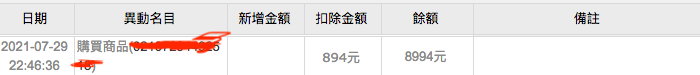
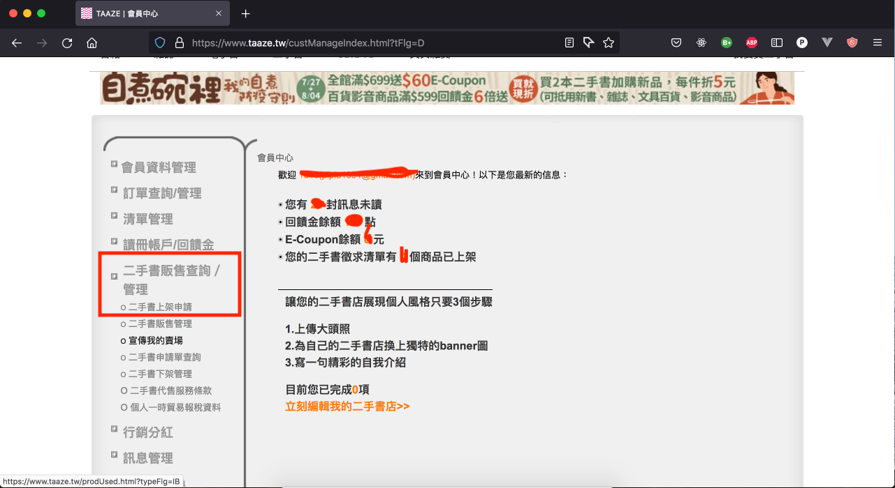
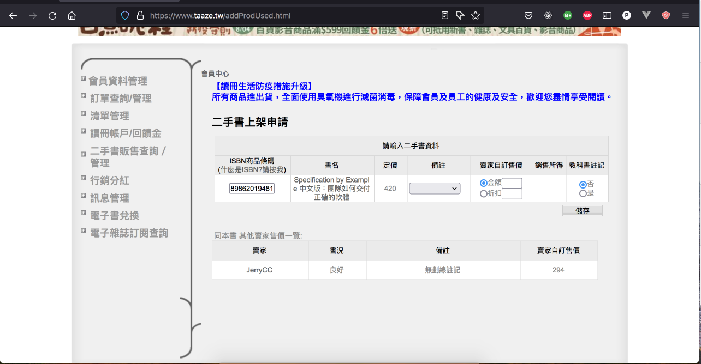
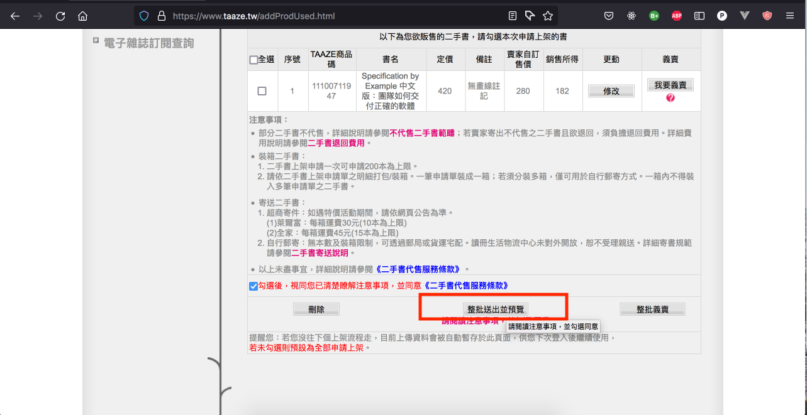
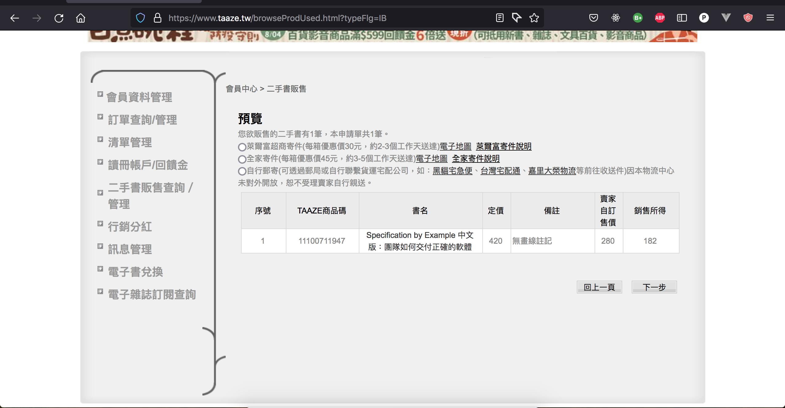
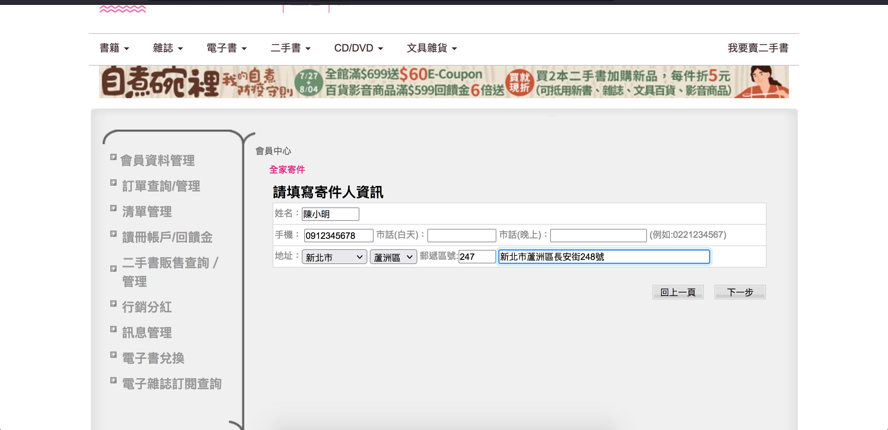
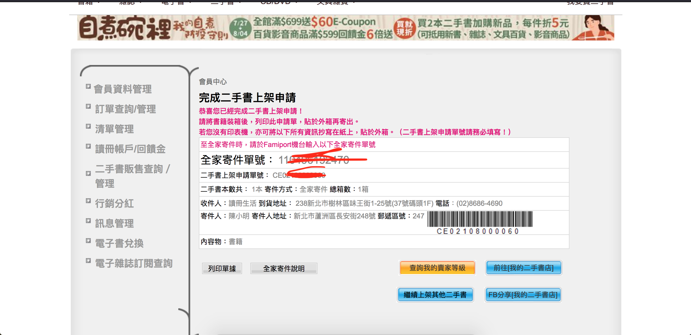

家裡的書多到書櫃裝不下，想清掉怎麼辦？以往或許會送資源回收、捐圖書館、或是賣給實體的二手書店，但都有一些小缺點：
- 收益微薄。二手書店多半只願意用 10 ~ 30 元收一本書，較舊的書甚至只能收到 5 塊錢，畢竟書店也是要賺錢啊；資源回收就更不用提了。
- 送書必須要專程跑一趟二手書店或是圖書館；有些二手書店雖然提供到府收書的服務，但多半都需要一定的量(例如一百本以上)才願意收。

現在多了一個新選擇：在讀冊上販賣二手書。

## 在讀冊上賣書有什麼好處？

- 收益比送實體二手書店要好：在讀冊上賣二手書，賣價由賣家自行訂定，而讀冊只收取 35% 的佣金，因此賺到的錢會比送二手書店來的多。舉例來說，假設某一本書我們決定賣 150，則賣出後我們就能拿到 **150元 * 65% = 98元**！都可以買一個雞腿便當了~~賺到的錢除了在讀冊上買書，也可以匯出現金。
- 送書跑一趟樓下全家就搞定。一箱書(15本)只要 45 元的手續費。考慮到賣書的收入還是划算的。

我個人大約在 2020 年 1 月開始在讀冊上賣書，到現在 2021 年 7 月底已經差不多一年半。以下是一些相關數字：
- 寄了 **141** 本書
- 賣出 **98** 本書
- 收益是 **8994** 元，還不包含一年以來在讀冊上買書折掉的錢，實際上應該是一萬出頭。
有圖為證：

心動的話，下面來介紹一下怎麼上架，以及一年半以來賣書的小心得。

## 怎麼送書到讀冊上架

1. 首先先從[讀冊首頁](https://www.taaze.tw/)登入讀冊會員
2. 登入之後，選左邊的「二手書販售查詢 / 管理」> 「二手書上架申請」

3. 進入後就可以開始填要上架的書籍的 isbn 了，填入後讀冊會幫你找出書名、原售價以及同本書其它賣家的售價，再自行填寫書況和訂價。

注意讀冊並不是所有的書都能申請上架，碰到過無法登記的書有：
- 太舊沒有 isbn，所以沒辦法登記
- 讀冊已經收了太多本一樣的書，所以沒辦法登記
- 外文書和大陸書雖然有 isbn，但有一定的機率不收。

4. 填完後勾選「已瞭解注意事項」，再按下「整批送出並預覽」

5. 送出後會要你勾選寄件方式，目前可以選擇全家、萊爾富或自行寄件，以下以全家為例

6. 接著會要你填寄件人名稱、電話和地址：

7. 填完後再按確認，就會產生一張申請單了；將申請單印出來貼在箱子上就可以準備裝箱寄件了。

如果沒有印表機，手寫申請單號、寄件人地址、收件人資訊貼在箱子上也是可以的。

書籍裝箱時注意箱子的尺寸大小和書的數量，例如全家一箱只能裝 15 本，且箱子的長度最大只能 45 公分，其餘兩邊只能 30 公分。可以直接看讀冊官網的[「二手書寄件問題」](https://www.taaze.tw/qa/view/i.html#d1)，寫得滿清楚的。

9. 最後就到各通路寄件就告一段落啦。注意事項和操作流程同樣可以直接看讀冊官網的[「二手書寄件問題」](https://www.taaze.tw/qa/view/i.html#d1)。

10. 寄件後通常過幾天讀冊就會寄 email 通知賣家書寄到倉庫了，但他們收書後還要經過清點和驗收，通常要過一兩週後才會真的上架。上架時也會有 email 通知。

## 心得

談談在上面賣書的心得：
- 讀冊有規定訂價不可超過原售價的七成，所以一本 300 塊的書我們最多只能賣 210 元。
- 最理想的書是沒有或很少人在上面賣，內容又豐富的書：這種書不論新舊，可以訂接近原售價 7 ~ 6 折的價錢，還是可以賣出去。
- 文學書或太冷門的領域書籍，則可以考慮訂低於 5 折的價錢，因為真的不好賣XD
- 登記時讀冊會顯示目前賣家最低價，我自己的經驗是大約低個 10~20 元即可，若是好書的話訂和最低價同樣價錢也無妨。
- 訂完價之後放著就好，不要急著調價，大約兩三個月上去調一次價錢就夠了。太常往下調除了可能少賺，也是累到自己。
- 有時會遇到上架之後又有人用最低價放上去，此時也不用急於跟著改訂價。只要不是數量太多的書，等最低價那本被買走後，最低價又會輪到自己，過一陣子還是能賣掉的。

整體來說我覺得很方便，既可以清掉不那麼需要的書又可以有一點回饋。

---

以上的經驗供大家參考，希望大家都能順利送出書籍，賺點小錢~